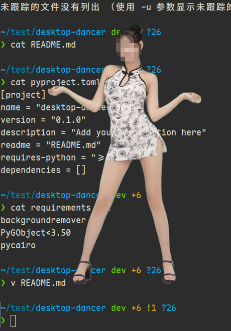
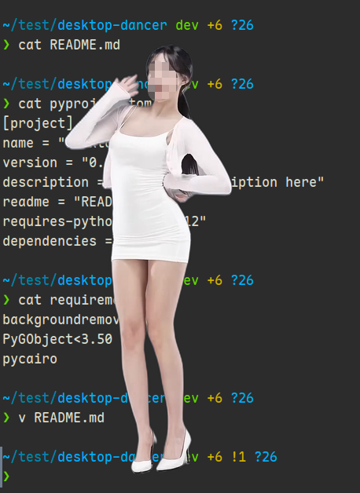
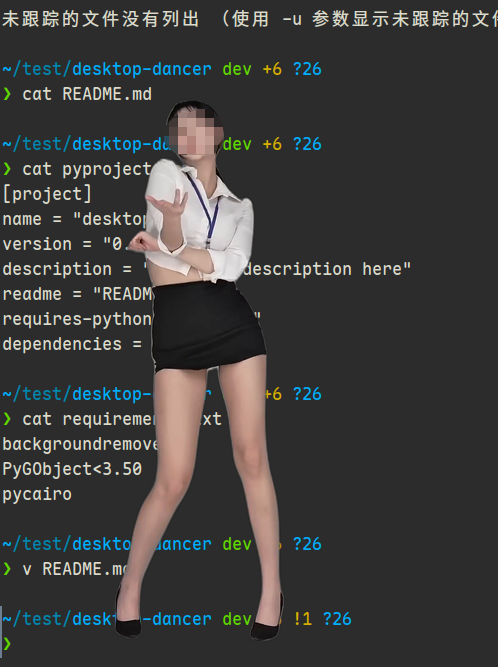

# DesktopGirlForLinux

把**任意视频中的人物**变成透明桌面对象，悬浮在 Linux 桌面最上层播放。

Turn **people in any video** into transparent desktop objects, floating and playing on top of the Linux desktop.

> 与同类项目的核心区别：**无需绿幕、无需透明素材**。内置 AI 视频抠图（Robust Video Matting）自动从普通视频中抠出前景，支持高速运动场景，帧间时序连贯不闪烁。

> The key difference from similar projects: **no green screen, no pre-made transparent assets required.** Built-in AI video matting (Robust Video Matting) with temporal memory — handles fast motion, no flickering between frames.


## 效果

- 透明背景，无边框，始终置顶
- 透明区域鼠标可穿透，点到下方窗口/桌面
- 左键拖动移动位置，滚轮缩放大小
- 双击左键切换置顶/取消置顶
- 右键菜单：切换角色 / 暂停 / 调速 / 退出
- 支持多个角色，右键菜单一键切换，记住上次选择

## Features

- Transparent background, borderless window, always on top
- Mouse clicks pass through transparent areas to windows beneath
- Left-drag to reposition, scroll wheel to zoom in/out
- Double-click to toggle always-on-top
- Right-click menu: switch character / pause / speed control / quit
- Multiple characters supported, switchable from the context menu, last selection remembered

## 依赖

**系统要求：** Linux Mint 22.3（或其他 X11 + 合成器的发行版）、ffmpeg

```bash
# 创建虚拟环境并安装依赖
uv venv .venv
uv pip install --python .venv/bin/python -r requirements.txt \
  --extra-index-url https://download.pytorch.org/whl/cpu
```

## Dependencies

**Requirements:** Linux Mint 22.3 (or any X11 distro with a compositor), ffmpeg

```bash
# Create virtual environment and install dependencies
uv venv .venv
uv pip install --python .venv/bin/python -r requirements.txt \
  --extra-index-url https://download.pytorch.org/whl/cpu
```

## 目录结构

```
desktop-dancer/
├── remove_bg.py      # 阶段1：AI 视频抠图（RVM），生成透明帧序列
├── dancer.py         # 阶段2：GTK 透明窗口播放
├── dancer/           # 角色目录
│   ├── .last         # 记录上次使用的角色（自动生成）
│   ├── anna01/       # 一个角色
│   │   ├── metadata.json
│   │   ├── frame_0001.png
│   │   └── ...
│   └── alyx2/        # 另一个角色
└── screenshot/
```

## Directory Structure

```
desktop-dancer/
├── remove_bg.py      # Phase 1: AI video matting (RVM), generates transparent frame sequence
├── dancer.py         # Phase 2: GTK transparent window player
├── dancer/           # Character directory
│   ├── .last         # Last used character (auto-generated)
│   ├── anna01/       # A character
│   │   ├── metadata.json
│   │   ├── frame_0001.png
│   │   └── ...
│   └── alyx2/        # Another character
└── screenshot/
```

## 使用

### 第一步：抠图

```bash
.venv/bin/python remove_bg.py --input 你的视频.mp4 --frames-dir dancer/角色名
```

首次运行会自动下载 RVM 模型权重（约 15MB）。

抠图完成后，建议先预览一帧确认效果：

```bash
eog dancer/角色名/frame_0001.png
```

#### 抠图参数

| 参数 | 说明 | 默认 |
|------|------|------|
| `--input` | 输入视频文件 | `jean.mp4` |
| `--frames-dir` | 输出帧目录 | `dancer/jean` |
| `--display-height` | 输出帧高度（px） | `450` |
| `--variant` | RVM 模型变体 | `mobilenetv3` |
| `--downsample-ratio` | 推理下采样（HD=0.25, 4K=0.125） | `0.25` |
| `--alpha-threshold` | 阴影抑制阈值（0~1） | `0.3` |
| `--backend` | 推理设备（auto/cpu/cuda） | `auto` |
| `--no-postprocess` | 跳过 mask 后处理 | 否 |
| `--overwrite` | 强制重新处理 | 否 |

### 第二步：启动

```bash
.venv/bin/python dancer.py
```

| 参数 | 说明 | 默认 |
|------|------|------|
| `--dancer-dir` | 角色根目录 | `dancer` |
| `--scale` | 缩放比例 | `1.0` |
| `--sticky` | 在所有工作区显示 | 否 |
| `--x` / `--y` | 窗口初始位置 | 右下角 |

## Usage

### Step 1: Background Removal

```bash
.venv/bin/python remove_bg.py --input your_video.mp4 --frames-dir dancer/character_name
```

On first run, the RVM model weights (~15MB) are downloaded automatically.

After processing, preview a frame to verify the result:

```bash
eog dancer/character_name/frame_0001.png
```

### Step 2: Launch

```bash
.venv/bin/python dancer.py
```

Common options:

| Option | Description | Default |
|--------|-------------|---------|
| `--dancer-dir` | Character root directory | `dancer` |
| `--scale` | Display scale factor | `1.0` |
| `--sticky` | Show on all workspaces | off |
| `--x` / `--y` | Initial window position | bottom-right |

## 控制

| 操作 | 效果 |
|------|------|
| 左键拖动 | 移动窗口 |
| 滚轮上/下 | 放大 / 缩小（0.3x ~ 3.0x） |
| 双击左键 | 切换置顶 / 取消置顶 |
| 右键单击 | 弹出菜单 |

### 右键菜单

| 功能 | 说明 |
|------|------|
| ⏸ 暂停 / ▶ 继续 | 暂停或继续动画播放 |
| ⏩ 速度 | 调整播放速度（0.5x / 0.75x / 1.0x / 1.5x / 2.0x） |
| 📌 置顶切换 | 切换始终置顶 / 取消置顶 |
| 角色列表 | 点击切换到其他角色 |
| ✕ 退出 | 关闭程序 |

## Controls

| Action | Effect |
|--------|--------|
| Left-drag | Move window |
| Scroll up/down | Zoom in/out (0.3x – 3.0x) |
| Double-click | Toggle always-on-top |
| Right-click | Context menu |

### Context Menu

| Function | Description |
|----------|-------------|
| ⏸ Pause / ▶ Resume | Pause or resume animation |
| ⏩ Speed | Adjust playback speed (0.5x / 0.75x / 1.0x / 1.5x / 2.0x) |
| 📌 Pin toggle | Toggle always-on-top |
| Character list | Switch to another character |
| ✕ Quit | Close the program |

## 技术说明

- **抠图引擎**：[Robust Video Matting](https://github.com/PeterL1n/RobustVideoMatting)（GRU 时序循环网络），帧间状态传递，高速运动不丢肢体
- **阴影抑制**：后处理流水线（alpha 阈值 + 形态学开运算 + 最大连通区域保留）自动去除阴影残留
- **展示**：GTK3 + RGBA visual 实现透明窗口，Cairo 逐帧绘制，GLib 定时器驱动动画
- **鼠标穿透**：`input_shape_combine_region` 按帧更新，透明像素不响应鼠标事件

## Technical Notes

- **Matting engine**: [Robust Video Matting](https://github.com/PeterL1n/RobustVideoMatting) (GRU recurrent network) with temporal state propagation — no limb loss even during fast motion
- **Shadow suppression**: Post-processing pipeline (alpha threshold + morphological opening + largest connected component) automatically removes shadow artifacts
- **Display**: Transparent window via GTK3 RGBA visual, Cairo per-frame rendering, GLib timer-driven animation
- **Click-through**: `input_shape_combine_region` updated per frame so transparent pixels never intercept mouse events


## 效果展示




